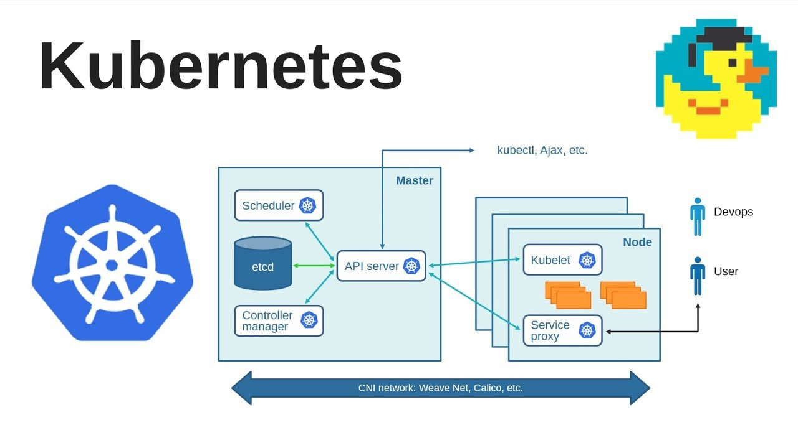

# Introduction to Kubernetes

[](https://www.youtube.com/watch?v=6tBKw3PFYx8 "Intro to Kubernetes (1/3)")

## What is Kubernetes?

### Architecture



### Objects

- Pod
- Deployment
- ConfigMap / Secret
- Service
- Ingress
- StatefulSet
- PersistentVolume / PersistentVolumeClaim

## Setup

1. Install kubectl. See
   [the official instructions](https://kubernetes.io/docs/tasks/tools/install-kubectl/),
   to grab the latest binary:

```
curl -LO "https://dl.k8s.io/release/$(curl -L -s https://dl.k8s.io/release/stable.txt)/bin/linux/amd64/kubectl"
sudo install -o root -g root -m 0755 kubectl /usr/local/bin/kubectl
```

2. Install k3d. See [their instructions](https://k3d.io/#installation), but
   TL;DR:

```
curl -s https://raw.githubusercontent.com/rancher/k3d/main/install.sh | bash
```

3. Create a cluster:

```
k3d cluster create my-cluster --servers 1 --agents 3 -p 8080:80@loadbalancer
```

4. Check it's working:

```
kubectl get nodes
```

## Use the CLI to create a deployment

1. Create the deployment:

```
kubectl create deployment test --image=containous/whoami --port 80
```

2. Check for the deployed pod:

```
kubectl get pods
```

2. Access it via a port forward:

```
kubectl port-forward pods/test-xxxxxxxxxx-xxxxx 8081:80
curl localhost:8081
```

3. Create a service for the deployment:

```
kubectl create service clusterip test --tcp=80:80
```

4. Create an ingress to expose the service:

```
kubectl create ingress test --rule="whoami/*=test:80"
```

5. Access the app from the ingress controller:

```
curl -H 'Host: whoami' localhost:8080
```

6. Scale the deployment:

```
kubectl scale deployment test --replicas=3
```

7. Delete everything:

```
kubectl delete ingress test
kubectl delete service test
kubectl delete deployment test
```

## WordPress with custom YAML

- Kubernetes API reference: https://kubernetes.io/docs/reference/generated/kubernetes-api/v1.20/
- WordPress Docker image: https://hub.docker.com/_/wordpress/

1. Create the resources:

```
kubectl apply -f wordpress/app.yaml
kubectl apply -f wordpress/db.yaml
kubectl apply -f wordpress/frontend.yaml
```

2. Scale the deployment:

```
kubectl scale deployment wordpress --replicas=3
```

3. Delete everything

```
kubectl delete -f wordpress/db.yaml -f wordpress/app.yaml -f wordpress/frontend.yaml
```
